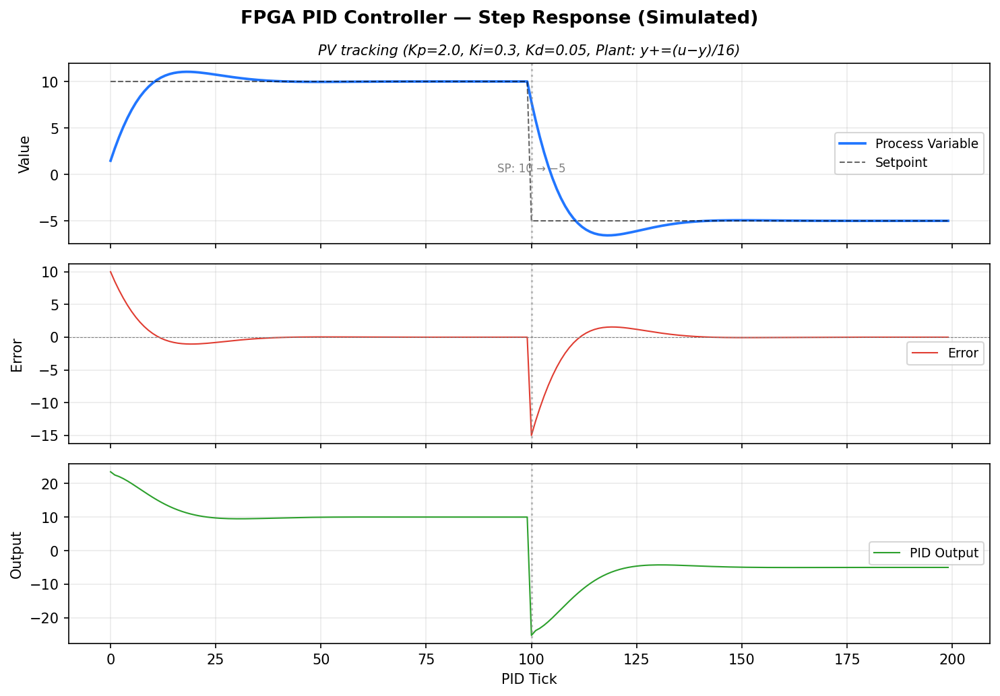
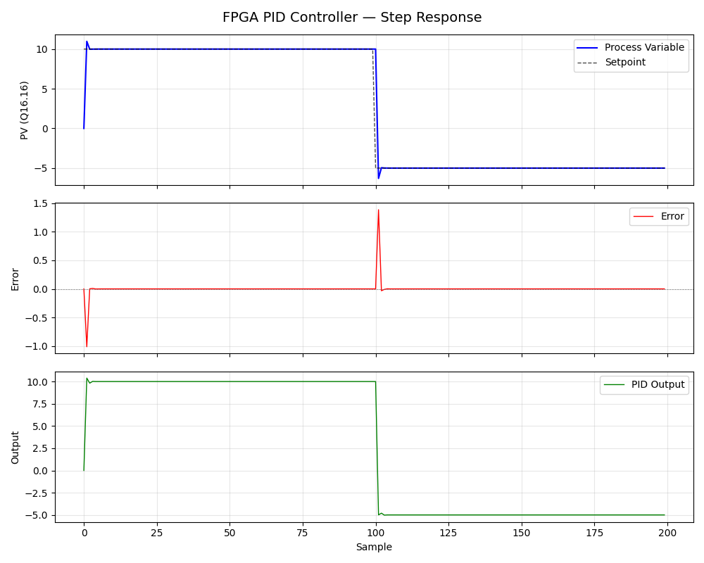

# FPGA PID Controller — KC705

Fixed-point PID controller on Xilinx Kintex-7 (KC705) with MicroBlaze
soft-processor, UART command interface, and built-in test plant. Designed
for closed-loop laser beam stabilization but usable as a general-purpose
digital PID core.

Verified in simulation (4/4 tests passing) and on hardware.

## Architecture

```
                        KC705 FPGA (XC7K325T)
  ┌──────────────────────────────────────────────────┐
  │                                                  │
  │   Clocking Wizard          MicroBlaze            │
  │   200MHz diff ──→ 100MHz ──→ (64KB BRAM)         │
  │                              │                   │
  │                         AXI4-Lite Bus            │
  │                     ┌────┬────┬────┐             │
  │                     │    │    │    │             │
  │                  UART  GPIO  PID  Debug          │
  │                 115200  LEDs  Core  MDM          │
  │                   │     │    │                   │
  └───────────────────┼─────┼────┼───────────────────┘
                      │     │    │
                   USB-UART LEDs │
                   (K24/M19)     │
                                 ├── Tick Generator (configurable 1Hz–100kHz)
                                 ├── PID Engine (Q16.16, anti-windup)
                                 └── Test Plant (y += (u-y)/16)
```

| Component | File | Description |
|-----------|------|-------------|
| PID Core | `rtl/pid_controller.v` | Q16.16 fixed-point, 3-stage pipeline, anti-windup saturation |
| Tick Generator | `rtl/tick_generator.v` | Programmable loop rate via clock divider |
| AXI Wrapper | `rtl/pid_axi_wrapper.v` | AXI4-Lite slave, 14 registers, built-in test plant |
| Testbench | `tb/tb_pid_controller.v` | 4 test cases: P-only, PI, PID with step change, saturation |
| Build Script | `scripts/build_project.tcl` | Creates complete Vivado block design from scratch |
| Firmware | `vivado/pid_firmware.c` | MicroBlaze UART CLI — zero floating-point (integer-only Q16.16) |
| Constraints | `constraints/kc705_pid.xdc` | KC705 pin assignments (UART, LEDs, reset) |
| PC Monitor | `python_monitor/pid_monitor.py` | Serial terminal + matplotlib step response plots |

## Simulation Results

All four testbench cases pass using Vivado xsim:

```
--- Test 1: P-only (Kp=0.5, SP=10) ---        PV = 3.333   PASSED
--- Test 2: PI (Kp=0.5, Ki=0.02, SP=10) ---   PV = 9.999   PASSED
--- Test 3: PID (SP: 10 → -5) ---             PV = -4.999   PASSED
--- Test 4: Saturation (out_max=5, SP=100) --- Out = 5.000   PASSED
```



To run simulation:

```bash
cd sim_work
xvlog ../rtl/pid_controller.v ../rtl/tick_generator.v \
      ../rtl/pid_axi_wrapper.v ../tb/tb_pid_controller.v
xelab tb_pid_controller -debug off -s sim_snapshot
xsim sim_snapshot -runall
```

## Hardware Results

Step response captured from KC705 hardware via Python monitor:



## Quick Start

### 1. Build the Vivado project

```tcl
# In Vivado 2023.2 TCL console:
source E:/PID_KC705_RESOURCES/fpga_pid_controller/scripts/build_project.tcl
```

This creates the complete block design at `E:/Varshith_projects/PID_KC705`:
MicroBlaze + Clocking Wizard + UARTLite + GPIO + PID wrapper. Then:

1. Run Synthesis → Implementation → Generate Bitstream
2. File → Export Hardware (include bitstream) → produces `.xsa`

### 2. Build firmware in Vitis Classic

1. Open Vitis Classic 2023.2
2. Create Platform Project from the exported `.xsa`
3. Create Application Project (Empty C application)
4. Copy `vivado/pid_firmware.c` into the `src/` folder
5. Build → Program FPGA → Run

### 3. Test over UART

Connect to KC705 USB-UART at **115200 baud, 8N1**:

```
> help              # list commands
> demo              # step response: SP 0→10→-5 with test plant
> status            # show Kp, Ki, Kd, SP, PV, error, output
> kp 0.5            # set gains
> ki 0.02
> sp 10
> plant on          # enable built-in test plant
> enable            # start PID loop
> monitor 50        # print 50 CSV readings
```

### 4. Plot with Python

```bash
pip install pyserial matplotlib
python python_monitor/pid_monitor.py COM5 --demo
```

## Register Map (AXI4-Lite, base = 0x00010000)

| Offset | Name | R/W | Description |
|--------|------|-----|-------------|
| 0x00 | CTRL | R/W | [0]=enable, [1]=clear_integral, [2]=use_test_plant |
| 0x04 | STATUS | R | [0]=pid_done, [1]=saturated |
| 0x08 | KP | R/W | Proportional gain (Q16.16) |
| 0x0C | KI | R/W | Integral gain (Q16.16) |
| 0x10 | KD | R/W | Derivative gain (Q16.16) |
| 0x14 | SETPOINT | R/W | Target value (Q16.16) |
| 0x18 | PROC_VAR | R/W | Process variable — read=actual, write=manual (Q16.16) |
| 0x1C | PID_OUT | R | Controller output (Q16.16) |
| 0x20 | ERROR | R | Current error = setpoint - process_var (Q16.16) |
| 0x24 | OUT_MIN | R/W | Output clamp minimum (Q16.16) |
| 0x28 | OUT_MAX | R/W | Output clamp maximum (Q16.16) |
| 0x2C | TICK_DIV | R/W | Loop rate = 100MHz / TICK_DIV |
| 0x30 | TICK_CNT | R | Total ticks since enable |
| 0x34 | PLANT_OUT | R | Test plant output (Q16.16) |

## Q16.16 Fixed-Point Format

All values use Q16.16 signed fixed-point:
- 32-bit total: 16-bit integer + 16-bit fraction
- Range: -32768.0 to +32767.9999847...
- Resolution: 1/65536 ≈ 0.0000153
- Example: `10.5` = `0x000A_8000` = `(10 << 16) | (0.5 * 65536)`

## Project Structure

```
fpga_pid_controller/
├── rtl/
│   ├── pid_controller.v       # PID core — Q16.16, pipelined, anti-windup
│   ├── tick_generator.v       # Programmable clock divider
│   └── pid_axi_wrapper.v     # AXI4-Lite slave + test plant model
├── tb/
│   └── tb_pid_controller.v   # 4-case testbench (P, PI, PID, saturation)
├── constraints/
│   └── kc705_pid.xdc         # KC705 pin constraints (clock, UART, LEDs, reset)
├── scripts/
│   └── build_project.tcl     # Automated Vivado block design builder
├── vivado/
│   └── pid_firmware.c        # MicroBlaze firmware — integer-only, no soft-float
├── python_monitor/
│   └── pid_monitor.py        # PC serial monitor + matplotlib plotting
├── DEVELOPMENT_LOG.md         # Bugs found & fixed during bring-up
└── README.md
```

## Bugs Found & Fixed

Five bugs were found and fixed during development and hardware bring-up.
Full details with root-cause analysis in [DEVELOPMENT_LOG.md](DEVELOPMENT_LOG.md).

| # | File | Bug | Impact |
|---|------|-----|--------|
| 1 | `pid_controller.v` | Unsigned concatenation in signed comparison | All tests fail — output always saturates to min |
| 2 | `pid_axi_wrapper.v` | Forward reference + clock alias hack | Compilation error in Vivado xvlog |
| 3 | `kc705_pid.xdc` | Wrong IOSTANDARD for LEDs in 2.5V I/O banks | Implementation DRC failure |
| 4 | `pid_firmware.c` | `atof()` pulls in 35KB soft-float library | .text overflows 64KB BRAM by 33KB |
| 5 | `pid_firmware.c` | Wrong `#ifndef` macro name for PID base address | All register reads return garbage |

## Hardware

- **Board:** Xilinx KC705 (Kintex-7 XC7K325T-2FFG900C)
- **Tools:** Vivado 2023.2 + Vitis Classic 2023.2
- **Clock:** 200MHz differential input → 100MHz via Clocking Wizard
- **UART:** 115200 baud, USB-UART bridge (CP2103), TX=K24 RX=M19
- **LEDs:** 8 GPIO LEDs (AB8, AA8, AC9, AB9, AE26, G19, E18, F16)
- **Reset:** Active-high pushbutton (AB7)

## License

MIT License
